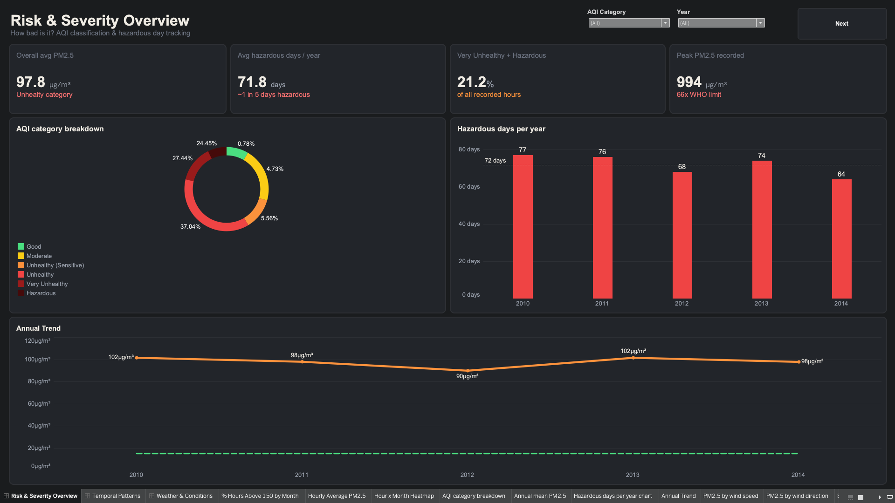
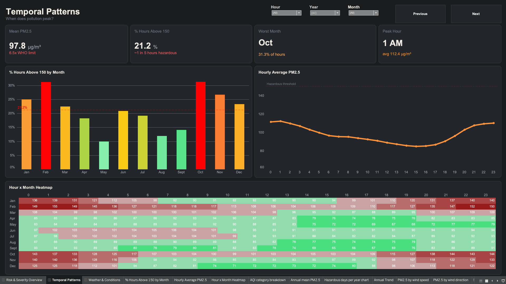
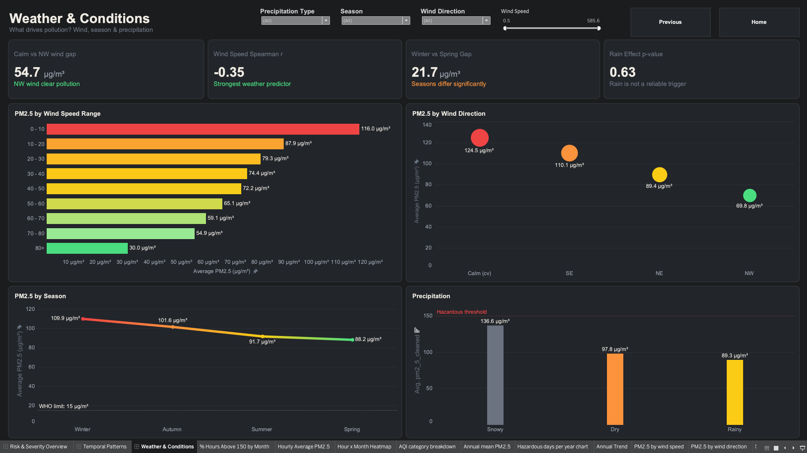

# Tableau Dashboards — Beijing PM2.5 Air Quality Analysis

This folder contains the three final Tableau dashboards developed for the Beijing PM2.5 Air Quality Analysis project.
The dashboards present key insights on pollution severity, temporal patterns, and meteorological drivers using an interactive and structured visual approach.

---

## Live Dashboard (Tableau Public)

Access the interactive dashboards here:

https://public.tableau.com/app/profile/milind.bansal5979/viz/DVA2-Capstone/RiskSeverityOverview

(Navigation-enabled multi-dashboard view: Risk & Severity Overview → Temporal Patterns → Weather & Conditions)

---

## Dashboard Overview

### Storytelling Flow

The dashboards are designed to follow a clear analytical narrative:

1. **Risk & Severity Overview (How bad is it?)**
   - Establishes the scale of the problem: AQI classification, hazardous day counts, and peak pollution records

2. **Temporal Patterns (When does it peak?)**
   - Explores which hours, months, and seasons experience the worst pollution

3. **Weather & Conditions (What drives it?)**
   - Identifies the meteorological factors — wind speed, wind direction, season, and precipitation — that are associated with the highest PM2.5

This structured flow ensures that users move from high-level severity metrics to time-based patterns to root-cause weather analysis in a logical progression.

---

### 1. Risk & Severity Overview



**Focus:**
- Overall pollution severity across the full 2010–2014 dataset
- AQI category distribution across all recorded hours
- Annual count of hazardous days (daily avg PM2.5 > 150 µg/m³)
- Long-term annual trend vs WHO safe limit

**Key Insights:**
- Mean PM2.5 of 97.8 µg/m³ — classified as Unhealthy category on the US EPA AQI scale
- Average of 71.8 hazardous days per year — approximately 1 in every 5 days exceeds the hazardous threshold
- 21.2% of all recorded hours fall into the Very Unhealthy or Hazardous categories
- Peak recorded reading of 994 µg/m³ — 66× the WHO annual guideline of 15 µg/m³
- AQI breakdown: 37% of hours are Unhealthy, only 0.78% are Good
- Hazardous days ranged from 64 (2014) to 77 (2010), with no year showing meaningful improvement
- Annual mean PM2.5 remained between 90–102 µg/m³ across all 5 years — consistently 6× above the WHO limit

---

### 2. Temporal Patterns



**Focus:**
- Which months have the highest proportion of hazardous hours
- How PM2.5 varies across the 24-hour daily cycle
- Hour × month heatmap showing the combined time-of-day and seasonal effect

**Key Insights:**
- Worst months are October (31.3%) and February (31.2%) — both exceed 30% of hours above 150 µg/m³
- Best months are May and August — below 15% of hours hazardous
- Peak hour is 1 AM with an average of 112.4 µg/m³ — driven by reduced atmospheric mixing and overnight traffic
- Midday hours (12–15h) show the lowest averages (~83–85 µg/m³) due to solar heating and wind activity
- The heatmap reveals that January and February mornings (0–4h) consistently show the highest cell values (136–155 µg/m³)
- Summer months (June–August) show a flatter, lower heatmap pattern across all hours — the only window with relatively safer air

---

### 3. Weather & Conditions



**Focus:**
- How wind speed, wind direction, season, and precipitation relate to PM2.5 levels
- Identifying the strongest meteorological predictors of pollution spikes

**Key Insights:**
- Wind speed is the strongest weather predictor — Spearman r = −0.35. Faster wind disperses pollution; the 0–10 m/s range averages 116 µg/m³ vs 30 µg/m³ at 80+ m/s
- Calm/variable wind (cv) produces the highest average PM2.5 at 124.5 µg/m³ — stagnant air traps pollutants over the city
- Northwest wind (NW) produces the lowest at 69.8 µg/m³ — a gap of 54.7 µg/m³ compared to calm conditions
- Winter averages 109.9 µg/m³ vs Spring at 88.2 µg/m³ — a gap of 21.7 µg/m³, statistically significant
- All four seasons exceed the WHO limit of 15 µg/m³ by at least 5×
- Snowy hours show the highest PM2.5 (136.6 µg/m³) but this is a seasonal confound — snow occurs during winter when pollution is already high, not a direct driver
- Rain effect p-value = 0.63 — rainfall is not a statistically significant predictor of pollution reduction

---

## Dashboard Features

- Interactive navigation buttons (Next / Previous / Home) across all three dashboards
- Context-aware filters on each dashboard:
  - Dashboard 1: AQI Category, Year
  - Dashboard 2: Hour, Year, Month
  - Dashboard 3: Precipitation Type, Season, Wind Direction, Wind Speed (range slider)
- KPI cards with sub-labels providing instant benchmark context (WHO limits, hazard thresholds)
- Consistent AQI color palette across all charts (Green → Yellow → Orange → Red → Dark Red → Maroon)
- WHO reference line (15 µg/m³) visible on Annual Trend and Seasonal charts
- Hazardous threshold line (150 µg/m³) on Precipitation chart
- Logical storytelling structure guiding users from severity → timing → cause

---

## Data Source

Dashboards are built using:
- `Beijing_PM25_Data_Cleaned.csv` (43,824 rows × 18 columns)
- Derived from the full data cleaning and statistical analysis pipeline
- Original source: UCI Machine Learning Repository — Beijing PM2.5 Dataset (2010–2014)

---

## Calculated Fields Used

| Field Name | Purpose |
|---|---|
| `Above 150 Flag` | Marks each hour as 1 if PM2.5 > 150, else 0 |
| `% Hours Above 150` | AVG of above flag × 100 — used in KPIs and bar chart |
| `Season` | Groups months into Winter / Spring / Summer / Autumn |
| `AQI Category` | Labels each hour by US EPA AQI scale (Good → Hazardous) |
| `Daily Avg PM2.5` | LOD expression — daily average used for hazardous day counting |
| `Is Hazardous Day` | Flags days where daily avg PM2.5 > 150 |
| `Precipitation Type` | Groups hours into Snowy / Rainy / Dry |
| `WHO Reference` | Constant = 15, used for reference lines across dashboards |

---

## Notes on Visualization Design

- Dark background (`#1A1C1E`) is used across all dashboards to reduce eye strain and make color-coded data more visually distinct
- AQI color palette follows the globally recognised US EPA standard — audiences familiar with air quality data will immediately understand the color coding
- Donut chart is used for AQI breakdown rather than a full pie to improve readability of percentage labels
- Horizontal bar chart is used for wind speed ranges to allow easy label reading across 10 bins
- Bubble/circle chart is used for wind direction to encode both category and magnitude in a single mark
- Line chart with dual axis is used for annual trend to allow the WHO reference line to share the same scale
- Heatmap uses a sequential color scale to show the combined hour × month interaction — a pattern that no single-axis chart could show
- Snowy bar in precipitation chart is intentionally colored grey (`#6B7280`) to signal it is a seasonal confound, not an actionable driver
- All font sizes follow a consistent hierarchy: KPI values at 28pt, units at 14pt, titles at 18pt, subtitles at 11pt

---

## Folder Structure

```text
tableau/
├── screenshots/
│   ├── Dashboard-1-Risk-Severity.png
│   ├── Dashboard-2-Temporal-Patterns.png
│   └── Dashboard-3-Weather-Conditions.png
└── README.md
```

---

## Summary

These dashboards translate 43,824 hours of Beijing air quality data into a structured, insight-driven narrative, enabling:

- Immediate understanding of how severe Beijing's PM2.5 problem is relative to global health benchmarks
- Clear identification of the highest-risk times of day, months, and seasons for pollution exposure
- Root-cause analysis of the meteorological conditions that drive pollution spikes
- Data-driven conclusions for public health policy — particularly around wind-based early warning systems and seasonal intervention windows
